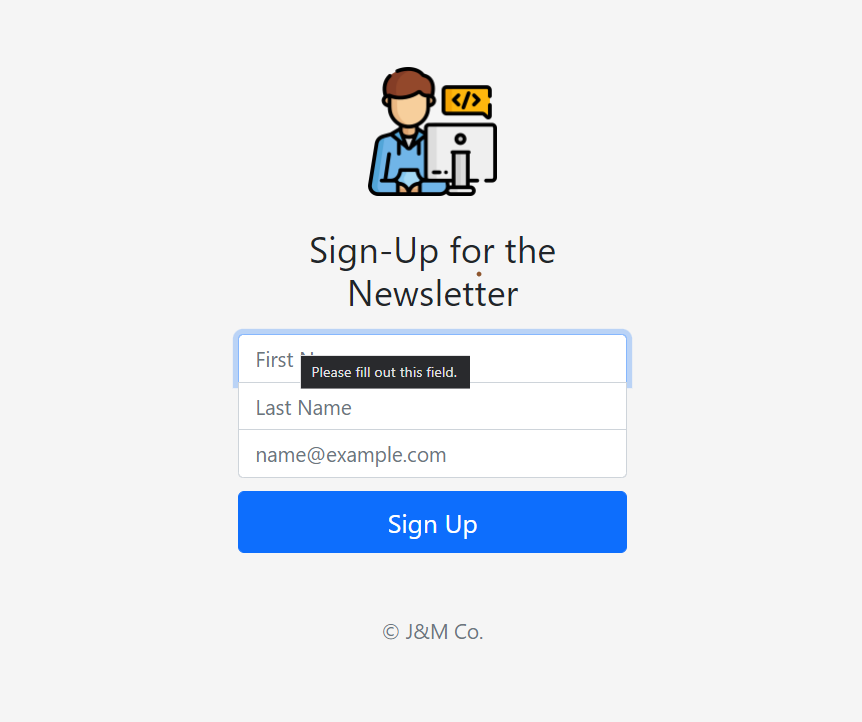

# Sign-Up for News letter
## This project in its living form can be found on a heroku's server at https://secret-badlands-77815.herokuapp.com/

Just learnt to play with mailchimp's api and setting up server in node and further configurations

Tech used:
- epxress
- bootstrap
- mailchimp api 
- html/css

